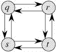

动态规划是一种算法范式, 它的思路是将一个复杂问题拆解成若干子问题, 同时保存子问题的答案, 使得每个子问题只需解一次, 最终获得原问题的答案. 若一个问题包含重复子问题和最优子结构这两个属性, 则表明其可以使用动态规划来解决.

#### 1. 重叠子问题

```java
int fib(int n) {
    if (n <= 1) {
        return n;
    }
    return fib(n - 1) + fib(n - 2);
}
```

上面是斐波那切数列的递归算法, 当我们执行 fib(5) 时, 可以得到如下的递归树, 可以看到其中光 fib(3) 就计算了两次(fib(3) 就是重复子问题), 如果我们记录了 fib(3) 的结果, 当我们再次计算它时, 只需重复使用之前计算出的结果即可, 不需要重复计算.

```
                         fib(5)
                     /             \
               fib(4)                fib(3)
             /      \                /     \
         fib(3)      fib(2)         fib(2)    fib(1)
        /     \        /    \       /    \
  fib(2)   fib(1)  fib(1) fib(0) fib(1) fib(0)
  /    \
fib(1) fib(0)
```

#### 2. 记忆化搜索

由上我们可以优化递归版本的算法: 构建一个查找表, 初始化查找数组所有的值为 NIL(这里使用 -1 表示). 当我们需要计算一个子问题时, 先在查找表中查找它. 如果有, 就返回它的值; 否则, 我们才计算这个值然后将其放入查找表中, 以便之后我们再次使用它, 算法如下:

```java
int[] dp;
int fib(int n) {
    if (n <= 1) {
        return n;
    }
    if (dp[n] == -1) {
        dp[n] = fib(n - 1) + fib(n - 2);
    }
    return dp[n];
}
```

#### 3. 动态规划

记忆化搜索是一个自上而下的解决问题, 比较符合我们的思维. 而动态规划是先解决小数据量下问题, 后根据结果层层递推更大的数据量是怎样的, 这是一个自底而上的过程. 同样是斐波那切数列, 动态规划会首先计算fib(0)然后是fib(1)然后是fib(2)再然后是fib(3)一次类推. 算法如下: 

```java
int fib(int n) {
    int[] dp = new int[n + 1];
    Arrays.fill(dp, -1);
    dp[0] = 0;
    dp[1] = 1;
    for (int i = 2; i <= n; i++) {
        dp[i] = dp[i - 1] + dp[i - 2];
    }
    return dp[n];
}
```

不管是记忆化搜索还是动态规划都需要记录子问题的结果. 在记忆化搜索的版本中, 表格是按需填充的; 而在动态规划中, 表格是从第一个节点一直填充到最后一个节点的. 不像动态规划, 记忆化搜索的查找表中的所有节点并不都是必须的. 例如 lcs 问题的记忆化解决法法不一定填充所有节点. 

#### 4. 最优子结构

那什么是最优子结构性质呢? 

如果利用子问题的最优解可以得到该问题的最优解，则该问题就具有最优子结构性质.

例如, 最短路径问题就具有最优子结构属性: 如果节点 x 位于从起始节点 u 到目标节点v的最短路径上, 则从 u 到 v 的最短路径是从 u 到 x 的最短路径和从x到v的最短路径组成. 

而最长路径问题是不具有最优子结构属性, 这里的最长路径是指两个节点之间的最长简单路径(无循环的路径). 如下, 从 q 到 t 有两天最长路径: q -> r -> t 和 q -> s -> t. 而最长路径 q -> r -> t 不是从 q 到 r 的最长路径和从 r 到 t 的最长路径的组合(q 到 r 的最长路径是 q -> s -> t -> r; r 到 t 的最长路径是 r -> q -> s -> t).

{: .center-block :}

#### 5. 参考

- [Overlapping Subproblems and Optimal Substructure Property in Dynamic Programming](https://www.geeksforgeeks.org/overlapping-subproblems-property-in-dynamic-programming-dp-1/)

- 玩转LeetCode面试算法 - 波波老师
